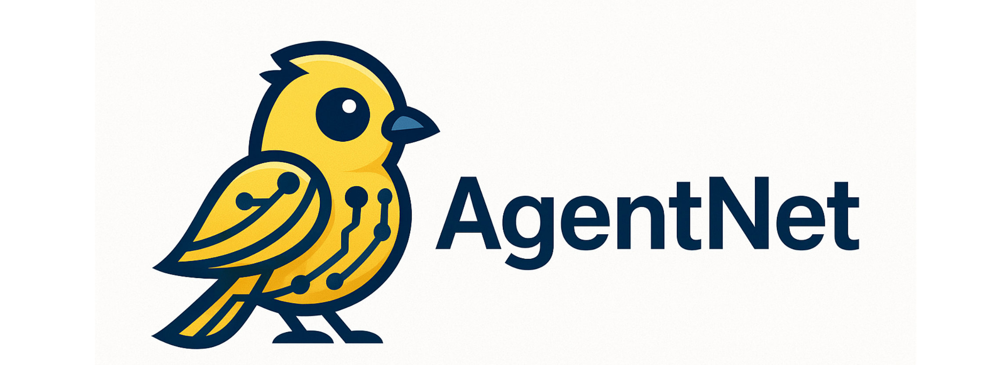

 
# AgentNet: Dynamically Graph Structure Selection for LLM-Based Multi-Agent System
 

 <font size=7><div align='center' > [[📖Paper](https://arxiv.org/abs/2510.01617)] [[🍎 Homepage](https://.github.io/)] </div></font> 
 
<p align="center">
    
</p>

<font size=7><div align='center' >   </div></font>  
You can experience our demo here (Coming soon)

## Introduction 
We introduce a dynamic, input-driven multi-agent system (MAS) that executes over learned communication graphs. First, we use Advantage Actor–Critic (A2C) to learn a stable distribution over edges, producing high-performing candidate graphs; then we fine-tune the base LLM (LoRA) as a graph selector that picks the best topology per input. The approach delivers consistent gains on structured reasoning (Crossword, Game-of-24, MMLU, BBH) and code generation (HumanEval) while keeping latency comparable to CoT/ToT-style and static-swarm baselines.  


## 👀 Motivation & Problem Statement
1. **Fixed collaboration graphs** in existing multi-agent LLM pipelines (e.g. GPTSwarm) can’t adapt to the unique reasoning demands of each input, leading to “one-size-fits-all” suboptimality.
2. **Reinforcement-learned graph** structures (via REINFORCE) improve things but suffer high variance and still remain static across samples.
3. **Key insight**: Different inputs benefit from different agent-interaction topologies—no single graph wins on every example .

## 🌟**AMAS Framework**
AgentNet unifies two core advances:
1. **Actor-Critic Graph Optimization**
   - Replace REINFORCE with an A2C (Advantage Actor-Critic) scheme to discover effective sparse subgraphs from a fully connected agent graph.
   - Actor samples and scores graphs; Critic network estimates baseline value, reducing variance and speeding convergence .
2. **Per-Input Graph Selector via LoRA Fine-Tuning**
   - From A2C training, take the top K candidate graphs (e.g. K = 4).
   - Fine-tune the same LLM backbone with low-rank adapters (LoRA) to act as a “graph selector”: given an input, it scores each candidate and picks the best topology on the fly.
   - Training signal is a listwise ranking loss that encourages higher selector scores for graphs that empirically perform better on that example .

## Experimental Validation
They evaluate on five diverse tasks:

 

Backbones: LLaMA-3 8B/70B, GPT-3.5-turbo, Deepseek R1 7B. <br/>
Baselines: single-agent COT, TOT, GOT; MAS engines AutoGPT, AgentVerse, GPTSwarm. <br/>

### Key results (LLaMA-3 8B/70B):
- AgentNet achieves 48.3% on Crossword vs. 44.7% (GPTSwarm)
- 37.4% on Game-of-24 vs. 34.3%
- Gains of 2–5 points across MMLU, BBH, HumanEval.
- Latency comparable to GPTSwarm despite dynamic selection .

## ⭐ Setup
### Requirements and Installation
```
git clone https://github.com/yuki-2025/Dyna_Swarm
cd AgentNet
conda create -n AgentNet python=3.10 -y
conda activate AgentNet
pip install --upgrade pip
pip install -r requirements.txt 
```

### Data Preparation
- First, prepare the npy file for direct cues, used to load the FAISS index
```
python my_scripts/demo_data_collect/construct_direct_cues.py
python my_scripts/demo_data_collect/encode_data.py my_scripts/demo_data_collect/direct_demos.json /root/autodl-tmp/my_gptswarm_icl/resources/bge-base-en-v1___5 my_scripts/demo_data_collect/direct_demos.npy

```

- Prepare the npy files for demos
```
python my_scripts/demo_data_collect/encode_data.py my_scripts/demo_data_collect/list_demos_propose.json /root/autodl-tmp/tot_icl/resources/BAAI/bge-base-en-v1___5 my_scripts/demo_data_collect/list_demos_propose.npy
python my_scripts/demo_data_collect/encode_data.py my_scripts/demo_data_collect/list_demos_if_correct.json /root/autodl-tmp/tot_icl/resources/BAAI/bge-base-en-v1___5 my_scripts/demo_data_collect/list_demos_if_correct.npy
python my_scripts/demo_data_collect/encode_data.py my_scripts/demo_data_collect/list_demos_suggest.json /root/autodl-tmp/tot_icl/resources/BAAI/bge-base-en-v1___5 my_scripts/demo_data_collect/list_demos_suggest.npy
python my_scripts/demo_data_collect/encode_data.py my_scripts/demo_data_collect/list_demos_value.json /root/autodl-tmp/tot_icl/resources/BAAI/bge-base-en-v1___5 my_scripts/demo_data_collect/list_demos_value.npy

```

- Run the MAS based on the 72B model (with direct cues) on the training samples to collect demo data
#### Graph structure: result/crosswords/tmp1/graph_8_0.pt
```
export OPENAI_API_KEY="EMPTY"
export num_reflections=2
export num_inner_iters=2
export depth=4
export branch_factor=2
export num_iters=1
export LM_MODEL_NAME=/root/autodl-tmp/tot_icl/resources/Qwen/Qwen2___5-72B-Instruct-GPTQ-Int4
export add_direct_cues="true"
export demo_method="fixed"
export EMBEDDING_MODEL_PATH="/root/autodl-tmp/tot_icl/resources/BAAI/bge-base-en-v1___5"
export TOP_K=6
nohup python -u my_scripts/run_crosswords_eval_graphs.py graph_0_0 train ./result/crosswords/tmp1 > train_0.log &

```


- Process the prompt-response data generated by the large model. Split into four demo sets according to prompt type, all formatted as input-output pairs

---
### Inference Using ICL
#### Experiments with the QWEN 7B Model:

- Prepare demo retrievers for different prompt types. Generate the npy files for demos
```

python my_scripts/demo_data_collect/encode_data.py my_scripts/demo_data_collect/list_demos_propose.json ./resources/bge-base-en-v1___5 my_scripts/demo_data_collect/list_demos_propose.npy
python my_scripts/demo_data_collect/encode_data.py my_scripts/demo_data_collect/list_demos_if_correct.json ./resources/bge-base-en-v1___5 my_scripts/demo_data_collect/list_demos_if_correct.npy
python my_scripts/demo_data_collect/encode_data.py my_scripts/demo_data_collect/list_demos_suggest.json ./resources/bge-base-en-v1___5 my_scripts/demo_data_collect/list_demos_suggest.npy
python my_scripts/demo_data_collect/encode_data.py my_scripts/demo_data_collect/list_demos_value.json ./resources/bge-base-en-v1___5 my_scripts/demo_data_collect/list_demos_value.npy
```

-  Run inference with the existing demo data
```
export OPENAI_API_KEY="EMPTY"
export num_reflections=1
export num_inner_iters=2
export depth=5
export branch_factor=2
export num_iters=1
export LM_MODEL_NAME=/root/autodl-tmp/my_gptswarm_icl/resources/Qwen/Qwen2___5-7B-Instruct
export add_direct_cues="false"
export demo_method="retrieved"
export EMBEDDING_MODEL_PATH=/root/autodl-tmp/my_gptswarm_icl/resources/bge-base-en-v1___5
export TOP_K=6
```

- Use the learned graph structure for inference

```
nohup python -u my_scripts/run_crosswords_eval_graphs.py graph_45_0 test ./result/crosswords/tmp1 > train_0.log &
0.xxxx

```
 
 

 
##  Statement

**AgentNet is trained on large-scale open-source corpus, and its output has randomness. Any content generated by AgentNet does not represent the views of the model developers. We are not responsible for any problems arising from the use, misuse, and dissemination of AgentNet, including but not limited to public opinion risks and data security issues.**
 
##  👍 Acknowledgement
AgentNet is built with reference to the following outstanding works: GPTSwarm, deepseek, Qwen-2.5 . Thanks！
 
